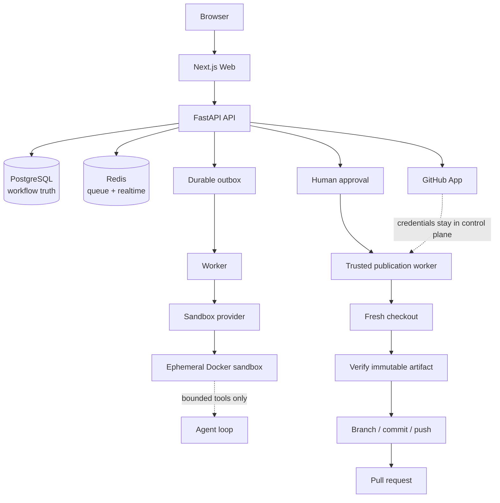

# AgentDock

**Secure AI coding-agent infrastructure with isolated execution and human-approved GitHub publication.**

AgentDock (the GitHub repository is [CodeForge-AI](https://github.com/Shriprasad-P/CodeForge-AI)) turns a focused coding task into an inspectable pull request. A worker gives a bounded agent a fresh Docker sandbox to inspect, edit, and validate a checkout. The browser receives live operational activity and a bounded diff preview. A human reviews the immutable artifact before a trusted service creates a branch, one commit, and one pull request.

## What it does

1. Connect a GitHub App installation and select a repository.
2. Describe one bounded coding task.
3. Let the worker inspect, edit, and validate inside an ephemeral sandbox.
4. Watch durable status and operational activity in the workspace.
5. Review the exact changed-file summary, diff preview, validation result, and artifact hash.
6. Approve or reject publication explicitly.
7. On approval, publish from a fresh checkout and open one pull request.

AgentDock is deliberately human-approved infrastructure, not an unattended autonomous coding bot.

## Architecture



The browser, API, PostgreSQL, Redis, GitHub App, and worker are control-plane services. Sandboxes are ephemeral execution boundaries: they receive only a materialized checkout and bounded tool inputs. They do not receive GitHub App keys, database or Redis credentials, session secrets, or LLM keys, and they never receive the Docker socket.

## Core engineering properties

- **Isolated execution:** non-root, short-lived Docker sandboxes with network disabled by default and no host socket.
- **Bounded tools:** path-safe file operations and argv-based commands; arbitrary shell strings are not accepted.
- **Immutable review:** the server stores a SHA-256-addressed publication artifact and verifies its version, hash, and base commit at approval and publication time.
- **Human-approved publication:** the agent cannot push directly; a trusted worker publishes only after owner approval.
- **PostgreSQL-authoritative state:** Redis queues, locks, and Pub/Sub support delivery and realtime but are not workflow truth.
- **Durable recovery:** an outbox, leases, idempotency keys, cancellation boundaries, and repository revocation fencing make retries explicit.
- **Realtime recovery:** authenticated WebSocket activity has sequence checks, reconnect backoff, REST resynchronization, and polling fallback.
- **Observable workflow:** request and workflow correlation, worker freshness, structured event fields, readiness checks, and metrics support diagnosis.

Source-backed details live in [docs/architecture.md](docs/architecture.md), [docs/security.md](docs/security.md), [docs/sandbox.md](docs/sandbox.md), [docs/publication.md](docs/publication.md), [docs/realtime.md](docs/realtime.md), and [docs/operations.md](docs/operations.md).

## Deterministic demo

The repository includes a small fixture and a deterministic fake LLM for a repeatable local demonstration. Use the task **“Add request validation to the `/users` endpoint and add tests.”** The golden path exercises real PostgreSQL, Redis, Docker, a local Git remote, and a GitHub API stub:

`task → durable delivery → worker → sandbox → modification → validation → immutable artifact → approval → fresh-checkout publication → one commit → one PR request → succeeded`

The full-system harness is opt-in and documented with the worker tests. It does not fabricate a production GitHub outcome.

## Local development

### Prerequisites

- Docker Desktop / Docker Engine with Compose
- Python 3.12 or 3.13
- Node.js 22+

### Start the control plane

```bash
cp .env.example .env
docker compose -f docker-compose.yml -f docker-compose.dev.yml up -d postgres redis
```

Run the API and web app using the instructions in [docs/operations.md](docs/operations.md), or start the complete local stack:

```bash
docker compose -f docker-compose.yml -f docker-compose.dev.yml up --build
```

Open [http://localhost:3000](http://localhost:3000) and follow **Register → Connect GitHub → Coding agent**. GitHub and LLM configuration are optional capabilities; local deterministic runs use `LLM_PROVIDER=fake`.

## Testing

```bash
# API
cd apps/api && source .venv/bin/activate && pytest -q

# Worker and sandbox
cd apps/worker && pytest -q

# Web
cd apps/web && npm test && npx tsc --noEmit && npm run lint && npm run build
```

The Stage 6 baseline verified 90 API tests, 54 worker tests with 1 Docker-gated skip, 28 frontend tests, and a deterministic golden-path E2E using real PostgreSQL, Redis, and Docker. Re-run the commands above before treating those counts as current.

## Current limitations

- A live GitHub installation and pull-request run requires local App credentials; CI uses a GitHub API stub.
- A hosted LLM provider is optional; the fake provider is the deterministic local path.
- The default Compose profile is intentionally a single API/worker replica; multi-replica WebSocket soak testing remains an operational follow-up.
- Diff previews are bounded for browser safety; the complete immutable artifact remains server-side for publication.

## Documentation

- [Architecture](docs/architecture.md) · [Security](docs/security.md) · [Sandbox](docs/sandbox.md)
- [GitHub App setup](docs/github-app.md) · [Publication](docs/publication.md) · [Realtime](docs/realtime.md)
- [Operations](docs/operations.md) · [Testing](docs/test-plan.md) · [Demo and screenshots](docs/demo.md) · [Development history](docs/development-history.md)

## Portfolio copy

**AgentDock — Secure AI coding-agent infrastructure with isolated execution and human-approved GitHub publication.**

AgentDock solves the trust gap between “ask an AI to change a repository” and “merge the resulting code.” It combines a FastAPI control plane, PostgreSQL-authoritative workflow state, Redis delivery and realtime recovery, a bounded agent loop, and ephemeral Docker sandboxes. Every change becomes an immutable, integrity-checked artifact; an owner must review and approve it before a trusted worker publishes one branch, one commit, and one pull request.

## GitHub presentation recommendations

- **Suggested repository description:** Secure AI coding-agent platform with sandboxed execution, immutable diff review, and human-approved GitHub publication.
- **Suggested topics:** `ai-agents`, `coding-agent`, `developer-tools`, `fastapi`, `nextjs`, `postgresql`, `redis`, `docker`, `github-app`, `agentic-ai`.
- **Homepage:** no deployed demo URL is claimed; use the repository until a real hosted environment exists.

## License

Proprietary / TBD.
